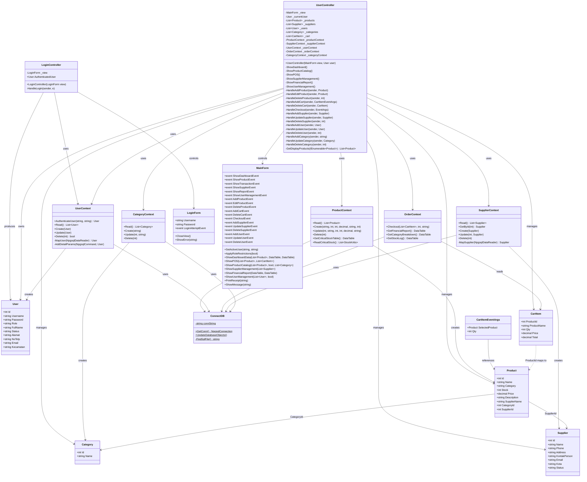

# Class Diagram — ChemLink

```mermaid
classDiagram
    direction TB

    %% ============ MODELS ============
    class User {
        +int Id
        +string Username
        +string Password
        +string Role
        +string FullName
        +string Status
        +string Alamat
        +string NoTelp
        +string Email
        +string Kecamatan
    }

    class Product {
        +int Id
        +string Name
        +string Category
        +int Stock
        +decimal Price
        +string Description
        +string SupplierName
        +int CategoryId
        +int SupplierId
    }

    class CartItem {
        +int ProductId
        +string ProductName
        +int Qty
        +decimal Price
        +decimal Total
    }

    class CartItemEventArgs {
        +Product SelectedProduct
        +int Qty
    }

    class Supplier {
        +int Id
        +string Name
        +string Phone
        +string Address
        +string KontakPerson
        +string Email
        +string Kota
        +string Status
    }

    class Category {
        +int Id
        +string Name
    }

    %% ============ CONTROLLERS ============
    class LoginController {
        -LoginForm _view
        +User AuthenticatedUser
        +LoginController(LoginForm view)
        -HandleLogin(sender, e)
    }

    class UserController {
        -MainForm _view
        -User _currentUser
        -List~Product~ _products
        -List~Supplier~ _suppliers
        -List~User~ _users
        -List~Category~ _categories
        -List~CartItem~ _cart
        -ProductContext _productContext
        -SupplierContext _supplierContext
        -UserContext _userContext
        -OrderContext _orderContext
        -CategoryContext _categoryContext
        +UserController(MainForm view, User user)
        -ShowDashboard()
        -ShowProductCatalog()
        -ShowPOS()
        -ShowSupplierManagement()
        -ShowFinancialReport()
        -ShowUserManagement()
        -HandleAddProduct(sender, Product)
        -HandleEditProduct(sender, Product)
        -HandleDeleteProduct(sender, int)
        -HandleAddCart(sender, CartItemEventArgs)
        -HandleDeleteCart(sender, CartItem)
        -HandleCheckout(sender, EventArgs)
        -HandleAddSupplier(sender, Supplier)
        -HandleUpdateSupplier(sender, Supplier)
        -HandleDeleteSupplier(sender, int)
        -HandleAddUser(sender, User)
        -HandleUpdateUser(sender, User)
        -HandleDeleteUser(sender, int)
        -HandleAddCategory(sender, string)
        -HandleUpdateCategory(sender, Category)
        -HandleDeleteCategory(sender, int)
        -GetDisplayProducts(IEnumerable~Product~) List~Product~
    }

    %% ============ CONTEXTS (DATA ACCESS) ============
    class ProductContext {
        +Read() List~Product~
        +Create(string, int, int, decimal, string, int)
        +Update(int, string, int, int, decimal, string)
        +Delete(int)
        +GetCriticalStockTable() DataTable
        +ReadCriticalStock() List~StockKritis~
    }

    class UserContext {
        +AuthenticateUser(string, string) User
        +Read() List~User~
        +Create(User)
        +Update(User)
        +Delete(int) bool
        -MapUser(NpgsqlDataReader) User
        -AddDetailParams(NpgsqlCommand, User)
    }

    class OrderContext {
        +Checkout(List~CartItem~, int, string)
        +GetFinancialReport() DataTable
        +GetCategoryBreakdown() DataTable
        +GetStockLog() DataTable
    }

    class SupplierContext {
        +Read() List~Supplier~
        +GetById(int) Supplier
        +Create(Supplier)
        +Update(int, Supplier)
        +Delete(int)
        -MapSupplier(NpgsqlDataReader) Supplier
    }

    class CategoryContext {
        +Read() List~Category~
        +Create(string)
        +Update(int, string)
        +Delete(int)
    }

    %% ============ HELPERS ============
    class ConnectDB {
        -string connString$
        +GetConn()$ NpgsqlConnection
        +UpdateDatabaseObjects()$
        -FindSqlFile()$ string
    }

    %% ============ VIEWS ============
    class LoginForm {
        +string Username
        +string Password
        +event LoginAttemptEvent
        +CloseView()
        +ShowError(string)
    }

    class MainForm {
        +event ShowDashboardEvent
        +event ShowProductEvent
        +event ShowTransactionEvent
        +event ShowSupplierEvent
        +event ShowReportEvent
        +event ShowUserManagementEvent
        +event AddProductEvent
        +event EditProductEvent
        +event DeleteProductEvent
        +event AddCartEvent
        +event DeleteCartEvent
        +event CheckoutEvent
        +event AddSupplierEvent
        +event UpdateSupplierEvent
        +event DeleteSupplierEvent
        +event AddUserEvent
        +event UpdateUserEvent
        +event DeleteUserEvent
        +SetActiveUser(string, string)
        +ApplyRoleRestrictions(bool)
        +ShowDashboardData(List~Product~, DataTable, DataTable)
        +ShowPOS(List~Product~, List~CartItem~)
        +ShowProductCatalog(List~Product~, bool, List~Category~)
        +ShowSupplierManagement(List~Supplier~)
        +ShowFinancialReport(DataTable, DataTable)
        +ShowUserManagement(List~User~, bool)
        +PrintReceipt(string)
        +ShowMessage(string)
    }

    %% ============ RELATIONSHIPS ============

    %% Controller dependencies
    LoginController --> LoginForm : controls
    LoginController --> UserContext : uses
    LoginController --> User : produces

    UserController --> MainForm : controls
    UserController --> ProductContext : uses
    UserController --> UserContext : uses
    UserController --> OrderContext : uses
    UserController --> SupplierContext : uses
    UserController --> CategoryContext : uses
    UserController --> User : owns
    UserController --> Product : manages
    UserController --> CartItem : manages
    UserController --> Supplier : manages
    UserController --> Category : manages

    %% Context dependencies
    ProductContext --> Product : creates
    ProductContext --> ConnectDB : uses
    UserContext --> User : creates
    UserContext --> ConnectDB : uses
    OrderContext --> CartItem : reads
    OrderContext --> ConnectDB : uses
    SupplierContext --> Supplier : creates
    SupplierContext --> ConnectDB : uses
    CategoryContext --> Category : creates
    CategoryContext --> ConnectDB : uses

    %% Model associations
    CartItemEventArgs --> Product : references
    CartItem ..> Product : ProductId maps to
    Product --> Category : CategoryId
    Product --> Supplier : SupplierId
```
