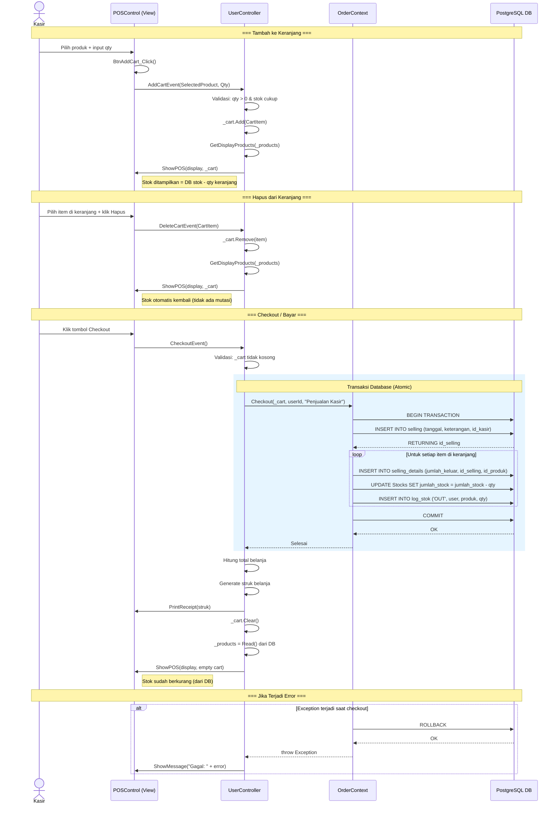

# Sequence Diagram — POS Checkout Flow

## Penjelasan Alur

### 1. Tambah ke Keranjang
- Kasir memilih produk dari grid POS dan memasukkan jumlah
- `POSControl` mengirim event ke `UserController`
- Item ditambahkan ke list `_cart` (in-memory)
- Tampilan stok dihitung ulang: `Stok DB - Qty Keranjang`
- **Tidak ada perubahan ke database**

### 2. Hapus dari Keranjang
- Kasir memilih item di grid keranjang dan klik Hapus
- Item dihapus dari list `_cart`
- Tampilan stok dihitung ulang otomatis
- **Tidak ada mutasi objek produk**

### 3. Checkout (Persist ke Database)
- Semua operasi dilakukan dalam **satu transaksi database atomik**
- Untuk setiap item keranjang:
  1. `INSERT` ke tabel `selling_details`
  2. `UPDATE` tabel `Stocks` (kurangi stok)
  3. `INSERT` ke tabel `log_stok` (catat aktivitas OUT)
- Jika semua berhasil → `COMMIT`
- Jika ada error → `ROLLBACK` (tidak ada perubahan)
