# Class Diagram — ChemLink

```mermaid
classDiagram
    direction TB

    %% ================================================================
    %%  MODELS
    %% ================================================================

    class User {
        +int Id
        +string Username
        +string Password
        +string Role
        +string FullName
        +bool Status
        +string Alamat
        +string NoTelp
        +string Email
        +string Kecamatan
    }

    class Product {
        +int Id
        +string Name
        +string Category
        +int Stock
        +decimal Price
        +string Description
        +string SupplierName
        +int CategoryId
        +int SupplierId
    }

    class CartItem {
        +int ProductId
        +string ProductName
        +int Qty
        +decimal Price
        +decimal Total
    }

    class CartItemEventArgs {
        <<EventArgs>>
        +Product SelectedProduct
        +int Qty
    }

    class Supplier {
        +int Id
        +string Name
        +string Phone
        +string Address
        +string KontakPerson
        +string Email
        +string Kota
        +string Status
    }

    class Category {
        +int Id
        +string Name
    }

    class StockKritis {
        +int IdProduk
        +string NamaProduk
        +int JumlahStock
    }

    %% ================================================================
    %%  VIEWS  (WinForms — Form & UserControl)
    %% ================================================================

    class LoginForm {
        <<Form>>
        +string Username
        +string Password
        +event LoginAttemptEvent
        +CloseView()
        +ShowError(string)
    }

    class MainForm {
        <<Form>>
        +event ShowDashboardEvent
        +event ShowProductEvent
        +event ShowTransactionEvent
        +event ShowSupplierEvent
        +event ShowReportEvent
        +event ShowUserManagementEvent
        +event LogoutEvent
        +event AddProductEvent
        +event EditProductEvent
        +event DeleteProductEvent
        +event ManageCategoryEvent
        +event AddCartEvent
        +event DeleteCartEvent
        +event CheckoutEvent
        +event SearchProductEvent
        +event FilterCategoryEvent
        +event AddSupplierEvent
        +event UpdateSupplierEvent
        +event DeleteSupplierEvent
        +event AddUserEvent
        +event UpdateUserEvent
        +event DeleteUserEvent
        +SetActiveUser(string, string)
        +ApplyRoleRestrictions(bool)
        +ShowDashboardData(List~Product~, DataTable, DataTable)
        +ShowPOS(List~Product~, List~CartItem~)
        +ShowProductCatalog(List~Product~, bool, List~Category~)
        +ShowSupplierManagement(List~Supplier~)
        +ShowFinancialReport(DataTable, DataTable)
        +ShowUserManagement(List~User~, bool)
        +PrintReceipt(string)
        +ShowMessage(string)
    }

    class ProductForm {
        <<Form>>
        +int ProductId
        +string ProductName
        +string CategoryName
        +int CategoryId
        +string SupplierName
        +int SupplierId
        +int Stock
        +decimal Price
        +string Description
        +ProductForm(List~Product~, List~Category~, List~Supplier~, Product)
    }

    class ManageCategoryForm {
        <<Form>>
        +event AddCategoryEvent
        +event UpdateCategoryEvent
        +event DeleteCategoryEvent
        +LoadCategories(List~Category~)
    }

    class AddSupplierForm {
        <<Form>>
        +Supplier NewSupplier
    }

    class EditSupplierDialog {
        <<Form>>
        +Supplier UpdatedSupplier
    }

    class UserForm {
        <<Form>>
        +User NewUser
    }

    class DashboardControl {
        <<UserControl>>
        +SetData(List~Product~, DataTable, DataTable)
    }

    class ProductCatalogControl {
        <<UserControl>>
        +event AddProductEvent
        +event EditProductEvent
        +event DeleteProductEvent
        +event ManageCategoryEvent
        +SetData(List~Product~, bool)
        +SetCategories(List~Category~)
    }

    class POSControl {
        <<UserControl>>
        +event AddCartEvent
        +event DeleteCartEvent
        +event CheckoutEvent
        +event SearchProductEvent
        +event FilterCategoryEvent
        +SetData(List~Product~, List~CartItem~)
    }

    class SupplierManagementControl {
        <<UserControl>>
        +event AddSupplierEvent
        +event UpdateSupplierEvent
        +event DeleteSupplierEvent
        +SetData(List~Supplier~)
    }

    class FinancialReportControl {
        <<UserControl>>
        +SetData(DataTable, DataTable)
    }

    class UserManagementControl {
        <<UserControl>>
        +event AddUserEvent
        +event UpdateUserEvent
        +event DeleteUserEvent
        +SetData(List~User~, bool)
    }

    %% ================================================================
    %%  CONTROLLERS
    %% ================================================================

    class LoginController {
        -LoginForm _view
        +User AuthenticatedUser
        +LoginController(LoginForm view)
        -HandleLogin(sender, e)
    }

    class MainController {
        -MainForm _view
        -User _currentUser
        -List~Product~ _products
        -ProductContext _productContext
        -OrderContext _orderContext
        -ProductController _productController
        -OrderController _orderController
        -SupplierController _supplierController
        -UserController _userController
        +MainController(MainForm view, User user)
        -ShowDashboard()
    }

    class ProductController {
        -MainForm _view
        -User _currentUser
        -List~Product~ _products
        -List~Category~ _categories
        -ProductContext _productContext
        -CategoryContext _categoryContext
        +ProductController(MainForm view, User user)
        +ShowProductCatalog()
        -HandleAddProduct(sender, Product)
        -HandleEditProduct(sender, Product)
        -HandleDeleteProduct(sender, int)
        -HandleManageCategory(sender, EventArgs)
    }

    class OrderController {
        -MainForm _view
        -User _currentUser
        -List~Product~ _products
        -List~CartItem~ _cart
        -string _currentCategoryFilter
        -string _currentSearchQuery
        -ProductContext _productContext
        -OrderContext _orderContext
        +OrderController(MainForm view, User user)
        +ShowPOS()
        +ShowFinancialReport()
        -GetDisplayProducts(IEnumerable~Product~) List~Product~
        -ApplyPOSFilters()
        -HandleFilterCategory(sender, string)
        -HandleSearchProduct(sender, string)
        -HandleAddCart(sender, CartItemEventArgs)
        -HandleDeleteCart(sender, CartItem)
        -HandleCheckout(sender, EventArgs)
    }

    class SupplierController {
        -MainForm _view
        -User _currentUser
        -List~Supplier~ _suppliers
        -SupplierContext _supplierContext
        +SupplierController(MainForm view, User user)
        +ShowSupplierManagement()
        -HandleAddSupplier(sender, Supplier)
        -HandleUpdateSupplier(sender, Supplier)
        -HandleDeleteSupplier(sender, int)
    }

    class UserController {
        -MainForm _view
        -User _currentUser
        -List~User~ _users
        -UserContext _userContext
        +UserController(MainForm view, User user)
        +ShowUserManagement()
        -HandleAddUser(sender, User)
        -HandleUpdateUser(sender, User)
        -HandleDeleteUser(sender, int)
    }

    %% ================================================================
    %%  CONTEXTS  (Data Access Layer)
    %% ================================================================

    class ProductContext {
        +Read() List~Product~
        +Create(string, int, int, decimal, string, int, int)
        +Update(int, string, int, int, decimal, string, int)
        +Delete(int)
        +GetCriticalStockTable() DataTable
        +ReadCriticalStock() List~StockKritis~
    }

    class UserContext {
        +AuthenticateUser(string, string) User
        +Read() List~User~
        +Create(User)
        +Update(User)
        +Delete(int) bool
        -MapUser(NpgsqlDataReader) User
    }

    class OrderContext {
        +Checkout(List~CartItem~, int, string)
        +GetFinancialReport() DataTable
        +GetCategoryBreakdown() DataTable
        +GetStockLog() DataTable
    }

    class SupplierContext {
        +Read() List~Supplier~
        +GetById(int) Supplier
        +Create(Supplier)
        +Update(int, Supplier)
        +Delete(int)
        -MapSupplier(NpgsqlDataReader) Supplier
    }

    class CategoryContext {
        +Read() List~Category~
        +Create(string)
        +Update(int, string)
        +Delete(int)
    }

    %% ================================================================
    %%  HELPERS
    %% ================================================================

    class ConnectDB {
        <<static>>
        -string connString$
        +GetConn()$ NpgsqlConnection
        +UpdateDatabaseObjects()$
        -FindSqlFile()$ string
    }

    %% ================================================================
    %%  DATABASE OBJECTS  (PostgreSQL)
    %% ================================================================

    class DBViews {
        <<PostgreSQL Views>>
        v_detail_produk
        v_stok_kritis
        v_laporan_keuangan
        v_log_stok
        v_user_aktif
        v_supplier
        v_kategori
        v_penjualan_per_kategori
    }

    class DBFunctions {
        <<PostgreSQL Functions>>
        fn_autentikasi_user(username)
        fn_hitung_total_pesanan(id_selling)
        fn_cek_ketersediaan_stok(id_produk, jumlah)
        fn_get_harga_produk(id_produk)
        fn_hapus_user(id_user)
    }

    class DBProcedures {
        <<PostgreSQL Stored Procedures>>
        sp_tambah_produk_baru(nama, harga, ket, idKat, idSup, idUser, stok)
        sp_update_produk(id, nama, idKat, harga, ket, stok, idSup)
        sp_hapus_produk(id_produk)
        sp_checkout(tgl, ket, kasir, prods, qtys)
        sp_tambah_user(user, pass, role, fullname, alamat, kec, telp, email)
        sp_update_user(id, user, pass, role, fullname, status, alamat, telp, email, kec)
        sp_kategori_create / update / delete
        sp_tambah_supplier(nama, kontak, telp, email, alamat, kota)
        sp_supplier_update(id, nama, kontak, telp, email, alamat, kota, status)
        sp_supplier_delete(id_supplier)
    }

    class DBTriggers {
        <<PostgreSQL Triggers>>
        fn_trg_selling_detail()
        fn_trg_stocks_update()
        fn_trg_produk_name_change()
    }

    %% ================================================================
    %%  RELATIONSHIPS
    %% ================================================================

    %% ── LoginController ──
    LoginController --> LoginForm : controls
    LoginController --> UserContext : uses
    LoginController --> User : produces

    %% ── MainController (coordinator) ──
    MainController --> MainForm : controls
    MainController --> ProductContext : uses
    MainController --> OrderContext : uses
    MainController --> ProductController : creates
    MainController --> OrderController : creates
    MainController --> SupplierController : creates
    MainController --> UserController : creates

    %% ── ProductController ──
    ProductController --> MainForm : subscribes to events
    ProductController --> ProductContext : uses
    ProductController --> CategoryContext : uses
    ProductController --> Product : manages
    ProductController --> Category : manages

    %% ── OrderController ──
    OrderController --> MainForm : subscribes to events
    OrderController --> ProductContext : uses
    OrderController --> OrderContext : uses
    OrderController --> CartItem : manages
    OrderController --> Product : reads

    %% ── SupplierController ──
    SupplierController --> MainForm : subscribes to events
    SupplierController --> SupplierContext : uses
    SupplierController --> Supplier : manages

    %% ── UserController ──
    UserController --> MainForm : subscribes to events
    UserController --> UserContext : uses
    UserController --> User : manages

    %% ── MainForm ↔ UserControl event wiring ──
    MainForm --> DashboardControl : hosts
    MainForm --> ProductCatalogControl : hosts
    MainForm --> POSControl : hosts
    MainForm --> SupplierManagementControl : hosts
    MainForm --> FinancialReportControl : hosts
    MainForm --> UserManagementControl : hosts

    %% ── UserControl → Dialog Forms ──
    ProductCatalogControl --> ProductForm : opens
    ProductCatalogControl --> ManageCategoryForm : opens
    SupplierManagementControl --> AddSupplierForm : opens
    SupplierManagementControl --> EditSupplierDialog : opens
    UserManagementControl --> UserForm : opens

    %% ── Context → ConnectDB ──
    ProductContext --> ConnectDB : uses
    UserContext --> ConnectDB : uses
    OrderContext --> ConnectDB : uses
    SupplierContext --> ConnectDB : uses
    CategoryContext --> ConnectDB : uses

    %% ── Context → DB Views (read) ──
    ProductContext --> DBViews : v_detail_produk, v_stok_kritis
    UserContext --> DBViews : v_user_aktif
    OrderContext --> DBViews : v_laporan_keuangan, v_log_stok, v_penjualan_per_kategori
    SupplierContext --> DBViews : v_supplier
    CategoryContext --> DBViews : v_kategori

    %% ── Context → DB Functions (query) ──
    UserContext --> DBFunctions : fn_autentikasi_user, fn_hapus_user

    %% ── Context → DB Procedures (write) ──
    ProductContext --> DBProcedures : sp_tambah/update/hapus_produk
    OrderContext --> DBProcedures : sp_checkout
    UserContext --> DBProcedures : sp_tambah/update_user
    CategoryContext --> DBProcedures : sp_kategori_create/update/delete
    SupplierContext --> DBProcedures : sp_tambah/update/hapus_supplier

    %% ── DB Procedures → DB Triggers ──
    DBProcedures --> DBTriggers : fires on DML
    DBViews --> DBTriggers : fn_trg_produk_name_change cascades

    %% ── Model associations ──
    CartItemEventArgs --> Product : references
    CartItem ..> Product : ProductId maps to
    Product --> Category : CategoryId
    Product --> Supplier : SupplierId
    ProductForm --> Category : binds cbKategori
    ProductForm --> Supplier : binds cbSupplier
```

---

## Relasi Utama Arsitektur

| Pola | Keterangan |
|---|---|
| **MVC Flow** | `Program → LoginForm/LoginController → MainForm/MainController` |
| **Koordinator** | `MainController` membuat `ProductController`, `OrderController`, `SupplierController`, `UserController` |
| **Event Wiring** | UserControl → MainForm events → Controller handlers → Context → Database |
| **Inheritance** | `Form ← MainForm, LoginForm, ProductForm, ManageCategoryForm, AddSupplierForm, EditSupplierDialog, UserForm` · `UserControl ← DashboardControl, ProductCatalogControl, POSControl, SupplierManagementControl, FinancialReportControl, UserManagementControl` |
| **Polymorphism** | Setiap controller override handler event masing-masing (HandleAdd/Edit/Delete) |
| **Encapsulation** | Field private readonly di Controller dan Context; property model membungkus data domain |
| **Database Abstraction** | Context memanggil Views (read), Procedures (write), Functions (query/auth) — tidak ada SQL langsung di Controller atau View |
| **Trigger Automation** | `fn_trg_selling_detail` auto-decrement stok + log OUT · `fn_trg_stocks_update` auto-log IN saat stok > 0 · `fn_trg_produk_name_change` cascade nama ke log_stok |
| **Last-Admin Protection** | `fn_hapus_user()` mengembalikan BOOLEAN — mencegah penghapusan admin terakhir |
